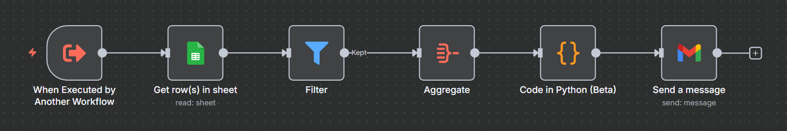

# 📊 Daily Lead Follow-Up Reporter

This project is an **n8n workflow** that automates the daily reporting of leads who have **not been called yet**.  
It takes input JSON data, formats it into a Gmail-friendly body, and sends all details in one combined email.

---

## ⚙️ Workflow Overview

### 1. **Aggregate Node**
Collects JSON input with the following structure:
```json
{
  "data": [
    {
      "row_number": 5,
      "Name": "Mahnoor",
      "Email": "mahnoorarif@yopmail.com",
      "budget": "0-100",
      "date": "2025-09-17T00:00:00.000+05:00",
      "message": "Need test on this budget",
      "Rejected": false,
      "Called": false
    },
    {
      "row_number": 6,
      "Name": "Mahnoor",
      "Email": "mahnoorarif23@yopmail.com",
      "budget": "0-100",
      "date": "2025-09-17T00:00:00.000+05:00",
      "message": "Need test on this budget",
      "Rejected": false,
      "Called": false
    }
  ]
}
```

---

### 2. **Code in Python (Beta)**
Formats the data into one Gmail-friendly message body:

```python
results = []

all_content = ""
for item in _input.all():
    for person in item.json["data"]:
        all_content += f"name: {person['Name']}\n" \                       f"email: {person['Email']}\n" \                       f"budget: {person['budget']}\n" \                       f"date: {person['date']}\n\n"

results.append({"json": {"email_content": all_content}})

return results
```

---

### 3. **Gmail Node**
- **Body:** use `{{$json["email_content"]}}`  
- Sends a single email containing all uncalled persons.

---

## ✅ Example Email Output

```
name: Mahnoor
email: mahnoorarif@yopmail.com
budget: 0-100
date: 2025-09-17T00:00:00.000+05:00

name: Mahnoor
email: mahnoorarif23@yopmail.com
budget: 0-100
date: 2025-09-17T00:00:00.000+05:00
```

---

## 📝 Notes
- Input must already be filtered for `"Called": false`.  
- The Python node combines all entries into **one daily email**.  
- Can be scheduled in n8n to run every day (e.g., morning).  
- Format is customizable (you can add `message` or other fields).

---

## 🔗 Workflow Image



## 🚀 Usage
1. Import workflow into **n8n**.  
2. Configure Gmail credentials.  
3. Schedule execution (cron: daily).  
4. Receive daily report of uncalled leads directly in your inbox.
