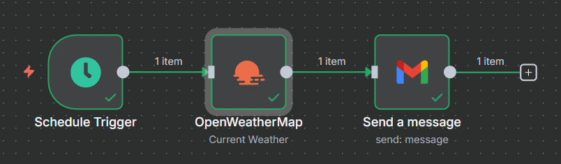

# 🌤️ Daily Weather Email Workflow

This **n8n workflow** sends you a **daily weather update email** every morning using **OpenWeatherMap** and **Gmail**.

---

## 📌 Overview
- **Trigger Time:** 6:00 AM daily  
- **Weather Source:** OpenWeatherMap API (ZIP Code: `49060`)  
- **Delivery:** Email via Gmail  

---

## ⚙️ Workflow Steps

1. **Schedule Trigger**  
   - Runs automatically every day at **6:00 AM**.  

2. **OpenWeatherMap Node**  
   - Fetches current weather data.  
   - Units: **Imperial** (°F, mph).  
   - Location: ZIP Code `49060`.  
   - Needs an **OpenWeatherMap API Key**.  

3. **Gmail Node**  
   - Sends the email with weather details.  
   - Recipient: `mahnoor.testing@gmail.com`  
   - Subject: **Daily weather**  
   - Message includes:  
     - Current temperature  
     - Min/Max temperature  
     - Wind speed  
     - City name  

   **Example Email:**
   ```
   Good Morning!
   The current temperature is 72°F in Kalamazoo
   with a temperature range of 68°F to 75°F
   and wind speed of 5 mph.
   ```

---
## Workflow image


## 🔑 Credentials Needed
- **OpenWeatherMap API Key**  
- **Gmail OAuth2**  

---

## ▶️ Setup Instructions
1. Import `Daily weather.json` into your **n8n** instance.  
2. Add your **OpenWeatherMap** and **Gmail** credentials.  
3. Enable the workflow.  
4. Start receiving **daily weather emails at 6 AM**.  

---

## 📝 Notes
- Workflow is **inactive** by default.  
- Update the **ZIP Code** in the OpenWeatherMap node for your city.  
- Adjust the **trigger time** in the Schedule node if needed.  
