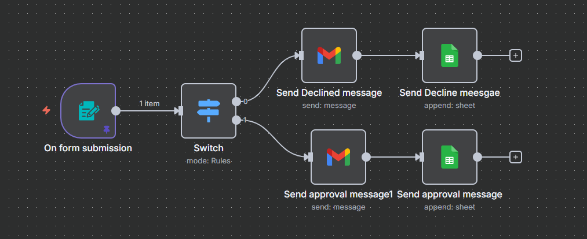

# 📩 Gmail Message to Form Users – n8n Workflow

## 🔹 Overview
This workflow automates handling **sponsorship inquiry forms**.  
When a form is submitted, it evaluates the budget, sends an approval or decline response via Gmail, and logs the inquiry into a **Google Sheet**.  

---

## 🔹 Workflow Steps

### 1. **On Form Submission (Form Trigger)**
- Triggers when a new form titled **“Sponsor inquiry”** is submitted.  
- Captures fields:  
  - Company Name  
  - Contact Name  
  - Email  
  - Budget (required, number)  
  - Notes  

### 2. **Switch (Budget Evaluation)**
- Evaluates the submitted **Budget** value:  
  - If `< 1,000,000` → Decline path.  
  - If `> 1,000,000` → Approval path.  

### 3. **Decline Path**
- **Send Declined Message (Gmail Node)**  
  - Sends an email to the user:  
    > “Hi [Contact Name], this is a very low budget for further discussion.”  
- **Send Decline Message (Google Sheets)**  
  - Logs the inquiry in Google Sheets with decision = `Declined`.  

### 4. **Approval Path**
- **Send Approval Message1 (Gmail Node)**  
  - Sends an email to the user:  
    > “Hi [Contact Name], how can I help you and how we make further discussion?”  
- **Send Approval Message (Google Sheets)**  
  - Logs the inquiry in Google Sheets with decision = `Approval message`.  

---

## 🔹 Key Features
✅ Automated handling of sponsorship form inquiries  
✅ Dynamic budget-based decision making  
✅ Personalized Gmail responses for approval/decline  
✅ Logs all inquiries and decisions into Google Sheets  

---

## 🔹 Setup Instructions
1. Import `Gmail message to form users.json` workflow into **n8n**.  
2. Configure credentials:  
   - **Gmail OAuth2** (for sending responses).  
   - **Google Sheets OAuth2** (for logging results).  
3. Update Google Sheet ID & Sheet Name in the **Google Sheets nodes**.  
4. Activate the workflow → new form submissions will be automatically processed.  
