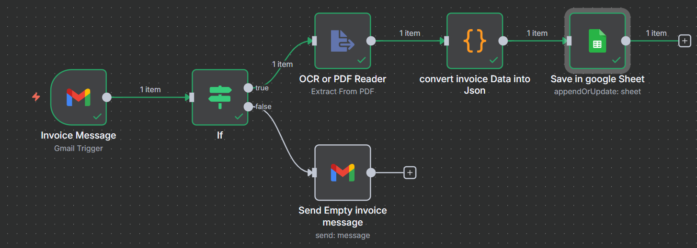

# 📄 Invoice Automation – n8n Workflow

## 🔹 Overview
This workflow automates the process of handling invoice emails in **n8n**.  
It detects invoice messages in Gmail, checks for attachments, extracts data from the invoice PDF, converts it into structured JSON, and finally stores the details into a **Google Sheet**. If an invoice is missing, it automatically replies to the sender requesting the PDF.

---

## 🔹 Workflow Steps

### 1. **Invoice Message (Gmail Trigger)**
- Watches Gmail inbox for new **unread** messages.  
- Uses filter:  
  ```
  subject:Invoice has:attachment
  ```
- Automatically downloads attachments.  

### 2. **If Node**
- Verifies whether the email has an attachment (`attachment_0`).  
- **If Yes:** proceed with PDF extraction.  
- **If No:** send a reply to the sender asking for the missing invoice.  

### 3. **Send Empty Invoice Message**
- Sends an automatic response to the sender if no invoice was attached.  
- Message:  
  > “Hi [Sender], you sent an empty invoice message. Please attach the PDF invoice so I can process it.”

### 4. **OCR or PDF Reader**
- Reads text content from the invoice PDF attachment.  
- Extracts raw text for processing.  

### 5. **Convert Invoice Data into JSON (Code Node)**
- Parses the extracted text into structured fields:  
  - **Company**  
  - **Invoice Number**  
  - **Due Date**  
  - **Total Amount**  
  - **Items (name, quantity, rate, amount)**  

### 6. **Save in Google Sheet**
- Saves parsed invoice details into a connected **Google Sheet**.  
- Columns mapped:  
  - `Invoice Number`  
  - `Amount`  
  - `Company`  
  - `Due Date`  
- Uses `Invoice Number` to avoid duplicate entries.  

---



## 🔹 Features
- 📥 Automatic invoice email detection  
- 📄 PDF text extraction (OCR support)  
- 🔎 Invoice data parsing into JSON  
- 📊 Invoice storage in Google Sheets  
- 📧 Error handling: reply when no attachment is found  

---

## 🔹 Setup Instructions
1. Import the `Invoice Automation.json` workflow into **n8n**.  
2. Configure credentials:  
   - **Gmail OAuth2** (for reading and sending emails)  
   - **Google Sheets OAuth2** (for saving data)  
3. Update Google Sheet ID and sheet name in the **Google Sheets node**.  
4. Activate the workflow.  

Once active, new invoice emails will be automatically processed, extracted, and saved in Google Sheets.


