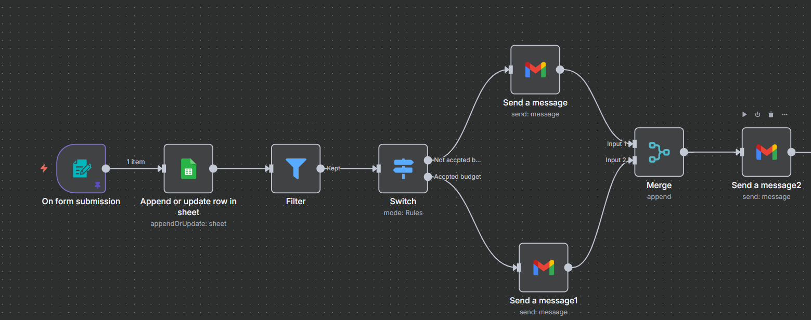

# 📧 n8n Gmail Formatter

This project contains an **n8n workflow** that formats JSON lead/contact data into a single Gmail email.  
It collects all persons who have **not been called yet** and sends their details in one combined email.

---

## ⚙️ Workflow Overview

1. **Aggregate Node**  
   Collects JSON data in the following structure:
   ```json
   {
     "data": [
       {
         "row_number": 5,
         "Name": "Mahnoor",
         "Email": "mahnoorarif@yopmail.com",
         "budget": "0-100",
         "date": "2025-09-17T00:00:00.000+05:00",
         "message": "Need test on this budget",
         "Rejected": false,
         "Called": false
       },
       {
         "row_number": 6,
         "Name": "Mahnoor",
         "Email": "mahnoorarif23@yopmail.com",
         "budget": "0-100",
         "date": "2025-09-17T00:00:00.000+05:00",
         "message": "Need test on this budget",
         "Rejected": false,
         "Called": false
       }
     ]
   }
   ```

2. **Code in Python (Beta)**  
   Formats the data into one Gmail-friendly string:
   ```python
   results = []

   all_content = ""
   for item in _input.all():
       for person in item.json["data"]:
           all_content += f"name: {person['Name']}\n" \                          f"email: {person['Email']}\n" \                          f"budget: {person['budget']}\n" \                          f"date: {person['date']}\n\n"

   results.append({"json": {"email_content": all_content}})

   return results
   ```

3. **Gmail Node**  
   - Use `{{$json["email_content"]}}` as the **email body**.  
   - Sends one email containing all uncalled persons.

---

## ✅ Example Email Body

```
name: Mahnoor
email: mahnoorarif@yopmail.com
budget: 0-100
date: 2025-09-17T00:00:00.000+05:00

name: Mahnoor
email: mahnoorarif23@yopmail.com
budget: 0-100
date: 2025-09-17T00:00:00.000+05:00
```

---
## 🔗 Workflow Image



## 📝 Notes
- The input is assumed to be already filtered for `"Called": false`.
- The Python node combines all entries into **one single email**.
- You can modify the format to include extra fields (like `message`).
