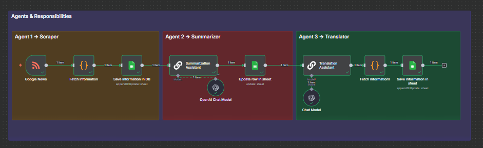

# 🤖 Multi AI Agent (n8n Workflow)

## 📌 Overview
This workflow demonstrates a **multi-agent AI pipeline** in **n8n**.  
It automates the process of:
1. Scraping articles from **Google News RSS**
2. Summarizing them into short factual texts
3. Translating summaries into **Spanish** and **French**
4. Saving all results into a **Google Sheet**

This setup simulates a **multi-agent system** where each agent (Scraper → Summarizer → Translator) works independently but contributes to a single pipeline.

---

## Workflow


## 🔄 Workflow Structure

### **Agent 1 – Scraper**
- **RSS Feed Node:** Fetches the latest news articles (e.g., Samsung, AI, Economy).
- **Code Node:** Normalizes article data into:
  - `Title`
  - `Link`
  - `Date`
  - `Source`
  - `Post`
- **Google Sheets Node:** Appends or updates rows in the sheet.

### **Agent 2 – Summarizer**
- **OpenAI Chat Model (`gpt-4.1-mini`):**
  - Summarizes each `Post` into 2–3 sentences.
  - System prompt ensures concise, fact-based output.
- **Google Sheets Node:** Updates the row with the new `Summary`.

### **Agent 3 – Translator**
- **OpenAI Chat Model (`gpt-4o-mini`):**
  - Translates the `Summary` into Spanish and French.
  - Returns structured JSON:  
    ```json
    {
      "spanish": "...",
      "french": "..."
    }
    ```
- **Code Node:** Parses JSON into fields.
- **Google Sheets Node:** Updates the row with `Spanish` and `French` translations.

---

## 📊 Data Flow
1. **Scraper** → adds rows:  
   `Title | Link | Date | Source | Post`
2. **Summarizer** → fills `Summary`.
3. **Translator** → fills `Spanish` and `French`.

---

## ⚡ Features
- End-to-end AI automation in n8n.
- Uses **Google Sheets** as the central database.
- Updates rows by matching `Link` (avoids duplicates).
- Multilingual output ready for reporting or publishing.

---

## 🛠️ Requirements
- An **n8n instance** (self-hosted or cloud).
- **Google Sheets credentials** with edit access.
- **OpenAI API key** with access to `gpt-4.1-mini` and `gpt-4o-mini`.

---

## 🚀 Setup Instructions
1. Import `Multi AI agent.json` into your n8n instance.
2. Update the **Google News RSS feed URL** inside Agent 1 if you want a different topic:
   ```
   https://news.google.com/rss/search?q=Samsung+Galaxy
   ```
3. Create a Google Sheet with columns:
   ```
   Title | Link | Date | Source | Post | Summary | Spanish | French
   ```
4. Connect your **Google Sheets** and **OpenAI** credentials in n8n.
5. Run the workflow → new rows will automatically be summarized and translated.

---

## ✅ Example Output

| Title                                   | Link   | Date                 | Source      | Summary                                              | Spanish                                                                 | French                                                                 |
|-----------------------------------------|--------|----------------------|-------------|------------------------------------------------------|------------------------------------------------------------------------|------------------------------------------------------------------------|
| Samsung finally makes Galaxy A17 4G ... | https://... | Fri, 19 Sep 2025 | Google News | Samsung has officially launched the Galaxy A17 4G... | Samsung ha lanzado oficialmente el smartphone Galaxy A17 4G...          | Samsung a officiellement lancé le smartphone Galaxy A17 4G...          |

---

## 🚀 Extensions
- Add more languages in the Translator.
- Send Slack/Discord alerts for new articles.
- Build dashboards (Looker Studio, Grafana) using the Google Sheet data.
