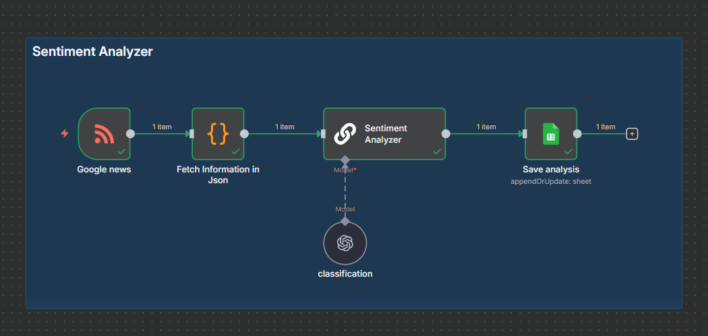

# 📊 Sentiment Analyzer (n8n Workflow)

## Overview
This n8n workflow automatically monitors **Google News** for articles about *Samsung Galaxy*, runs **sentiment analysis** using **OpenAI GPT-4o-mini**, and saves the results into a **Google Sheet**.

The workflow helps track whether news articles are **Positive, Neutral, or Negative** in tone, enabling you to build a live sentiment dashboard or trigger alerts.

---

## 🔗 Workflow Structure

1. **Google News (RSS Feed Trigger)**
   - Fetches the latest articles from Google News:
     ```
     https://news.google.com/rss/search?q=Samsung+Galaxy
     ```

2. **Fetch Information in JSON (Code Node)**
   - Cleans the RSS data and extracts:
     - `title` → Article title  
     - `link` → Article URL  
     - `text` → Content snippet  
     - `date` → Publication date  

3. **Sentiment Analyzer (Basic LLM Chain)**
   - Uses a custom prompt:
     ```
     You are a sentiment analysis assistant. 
     Only reply with one of these labels: Positive, Neutral, or Negative.
     Text: {{$json["text"]}}
     ```

4. **Classification (OpenAI Chat Model)**
   - Model: `gpt-4o-mini`  
   - Temperature: `0` (for consistent output)  
   - Runs classification for each article snippet.  

5. **Save Analysis (Google Sheets Node)**
   - Appends results into a connected Google Sheet.  
   - Columns:
     - Title  
     - Link  
     - Date  
     - Sentiment  

---

## ⚙️ Setup Instructions

### 1. Requirements
- n8n instance (local or cloud)  
- OpenAI API key (with GPT-4o-mini access)  
- Google Sheets account with a sheet prepared (columns: `Title | Link | Date | Sentiment`)

### 2. Connect Credentials
- **OpenAI** → Add API key in the `classification` node  
- **Google Sheets** → Connect OAuth2 in the `Save Analysis` node  

### 3. Activate Workflow
- Set the workflow to **Active**  
- It will run automatically every minute (configurable in the RSS trigger)  

---

## ✅ Example Output in Google Sheets

| Title                                        | Link  | Date                  | Sentiment |
|----------------------------------------------|-------|-----------------------|-----------|
| Samsung finally makes Galaxy A17 4G official | https://news.google.com/... | Fri, 19 Sep 2025 04:03 GMT | Positive |

---

## 🚀 WorkFlow

