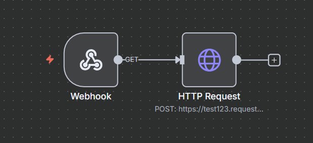

# 🌐 Webhook Workflow (n8n)

This project is an **n8n workflow** that listens for incoming HTTP requests via a webhook and forwards the data to an external endpoint.

---

## ⚙️ Workflow Overview

### 🔹 Nodes
1. **Webhook**  
   - Path: `130e216a-d30a-413c-b035-f27968fd4a32`  
   - Accepts incoming HTTP requests.  

2. **HTTP Request**  
   - Method: `POST`  
   - Forwards the received payload to:  
     ```
     https://test123.requestcatcher.com/
     ```

---

## ✅ Example Flow

1. A client sends a request to your n8n webhook URL:
   ```http
   POST https://<your-n8n-domain>/webhook/130e216a-d30a-413c-b035-f27968fd4a32
   Content-Type: application/json

   {
     "name": "Mahnoor",
     "email": "mahnoor@example.com"
   }
   ```

2. The workflow triggers automatically.  
3. The `HTTP Request` node forwards the same payload to `https://test123.requestcatcher.com/`.  

---

## 📂 Folder Structure

```
Webhook-Workflow/
│── Webhook.json      # Exported n8n workflow
│── README.md         # Project documentation
```

---

## 🔗 Workflow Image



## 🚀 Usage

1. Import `Webhook.json` into **n8n** (`Workflows → Import from File`).  
2. Activate the workflow.  
3. Send requests to:  
   ```
   https://<your-n8n-domain>/webhook/130e216a-d30a-413c-b035-f27968fd4a32
   ```
4. Check forwarded requests at `https://test123.requestcatcher.com/`.

---

## 📝 Notes
- Default method is `POST`.  
- You can change the destination URL in the **HTTP Request** node.  
- Useful for testing, logging, or proxying webhooks.  
